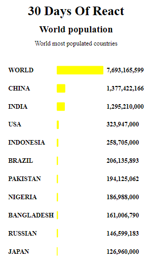
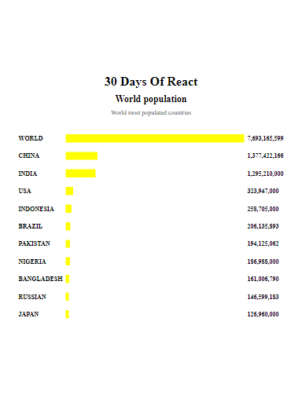
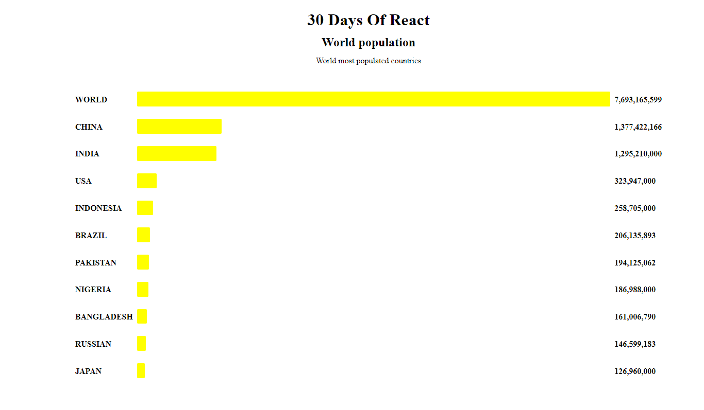

# 30days of React- day 06 Exercise level 2

This is a solution to the [30 days of React day 6 exercise level 2 question two](https://github.com/Asabeneh/30-Days-Of-React/blob/master/06_Day_Map_List_Keys/06_map_list_keys.md). This exercise challenges help you improve your react coding skills by building projects.

## Table of contents

- [Overview](#overview)
  - [The challenge](#the-challenge)
  - [Screenshot](#screenshot)
  - [Links](#links)
- [My process](#my-process)
  - [Built with](#built-with)
  - [Proud of this](#proud-of-this)
  - [Continued development](#continued-development)
- [Author](#author)

## Overview

### The challenge

Users should be able to:

- View the optimal layout for the site depending on their device's screen size

### Screenshot





### Links

- Solution URL: (https://github.com/ibimina/world-population)
- Live Site URL: (https://ibimina.github.io/world-population/)

## My process

### Built with

- Create react app
-  created and export Header component using props
- created and export Main component using props to map out array data
- Rendered App component
- CSS custom properties
- Flexbox
- CSS Grid
- Mobile-first workflow

### Proud of this

I used this function to set the list  maxWidth using the given array

```jsx
const len = props.tenHighestPopulation.map((pop) => (
  <li
    key={pop.country}
    style={{ maxWidth: (Number(pop.population)/ Number(popWidth)).toFixed(3) * 100 +'%'}}
    className="bar"
  >
    {/* {" "}
    {((Number(pop.population) / Number(popWidth)) * 100).toFixed(1)}
    {"% "} */}
  </li>
));

```
This maps out the props population to the li tag and  sets it to a localestring to add commas to the population number
```jsx
 const populationList = props.tenHighestPopulation.map((pop) => (
    <li key={pop.population} className="population">{pop.population.toLocaleString("en-US")}</li>
  ));
```
### Continued development

React framework

### Resource
I used this resource to learn how to add commas to numbers
- [Resource](https://code-boxx.com/add-comma-to-numberd-javascript/) 

## Author

- Ibimina Hart
 - Frontend Mentor - [ibimina](https://www.frontendmentor.io/profile/ibimina)
- Twitter - [ibiminaaH](https://www.twitter.com/ibiminaaH)
